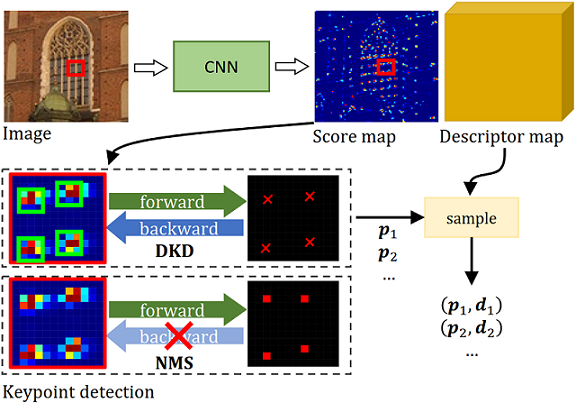

# ALIKE: Accurate and Lightweight Keypoint Detection and Descriptor Extraction

ALIKE applies a differentiable keypoint detection module to detect accurate sub-pixel keypoints. The network can run at 95 frames per second for 640 x 480 images on NVIDIA Titan X (Pascal) GPU and achieve equivalent performance with the state-of-the-arts. ALIKE benefits real-time applications in resource-limited platforms/devices. Technical details are described in [this paper](https://arxiv.org/pdf/2112.02906.pdf).

> ```
> Xiaoming Zhao, Xingming Wu, Jinyu Miao, Weihai Chen, Peter C. Y. Chen, Zhengguo Li, "ALIKE: Accurate and Lightweight Keypoint
> Detection and Descriptor Extraction," IEEE Transactions on Multimedia, 2022.
> ```




If you use ALIKE in an academic work, please cite:

```
@article{Zhao2022ALIKE,
      title={ALIKE: Accurate and Lightweight Keypoint Detection and Descriptor Extraction}, 
      author={Xiaoming Zhao and Xingming Wu and Jinyu Miao and Weihai Chen and Peter C. Y. Chen and Zhengguo Li},
      journal={IEEE Transactions on Multimedia},
      year={2022}
}
```


## 1. Prerequisites

The required packages are listed in the `requirements.txt` :

```shell
pip install -r requirements.txt
```


## 2. Models

The off-the-shelf weights of four variant ALIKE models are provided in `models/` .


## 3. Run demo

```shell
$ python demo.py -h
usage: demo.py [-h] [--model {alike-t,alike-s,alike-n,alike-l}]
               [--device DEVICE] [--top_k TOP_K] [--scores_th SCORES_TH]
               [--n_limit N_LIMIT] [--no_display] [--no_sub_pixel]
               input

ALike Demo.

positional arguments:
  input                 Image directory or movie file or "camera0" (for
                        webcam0).

optional arguments:
  -h, --help            show this help message and exit
  --model {alike-t,alike-s,alike-n,alike-l}
                        The model configuration
  --device DEVICE       Running device (default: cuda).
  --top_k TOP_K         Detect top K keypoints. -1 for threshold based mode,
                        >0 for top K mode. (default: -1)
  --scores_th SCORES_TH
                        Detector score threshold (default: 0.2).
  --n_limit N_LIMIT     Maximum number of keypoints to be detected (default:
                        5000).
  --no_display          Do not display images to screen. Useful if running
                        remotely (default: False).
  --no_sub_pixel        Do not detect sub-pixel keypoints (default: False).
```


## 4. Examples

### KITTI example
```shell
python demo.py assets/kitti 
```


### TUM example
```shell
python demo.py assets/tum 
```


## 5. Efficiency and performance

| Models | Parameters | GFLOPs(640x480) | MHA@3 on Hpatches | mAA(10°) on [IMW2020-test](https://www.cs.ubc.ca/research/image-matching-challenge/2021/leaderboard) (Stereo) |
|:---:|:---:|:---:|:-----------------:|:-------------------------------------------------------------------------------------------------------------:|
| D2-Net(MS) | 7653KB | 889.40 |      38.33%       |                                                    12.27%                                                     |
| LF-Net(MS) | 2642KB | 24.37 |      57.78%       |                                                    23.44%                                                     |
| SuperPoint | 1301KB | 26.11 |      70.19%       |                                                    28.97%                                                     |
| R2D2(MS) | 484KB | 464.55 |      71.48%       |                                                    39.02%                                                     |
| ASLFeat(MS) | 823KB | 77.58 |      73.52%       |                                                    33.65%                                                     |
| DISK | 1092KB | 98.97 |      70.56%       |                                                    51.22%                                                     |
| ALike-N | 318KB | 7.909 |      75.74%       |                                                    47.18%                                                     |
| ALike-L | 653KB | 19.685 |      76.85%       |                                                    49.58%                                                     |

### Evaluation on Hpatches

- Download [hpatches-sequences-release](https://hpatches.github.io/) and put it into `hseq/hpatches-sequences-release`.
- Remove the unrelaiable sequences as D2-Net.
- Run the following command to evaluate the performance:
  ```shell  
  python hseq/eval.py
  ```


For more details, please refer to the [paper](https://arxiv.org/abs/2112.02906).
